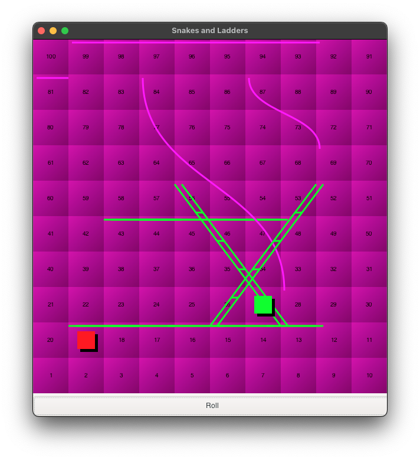
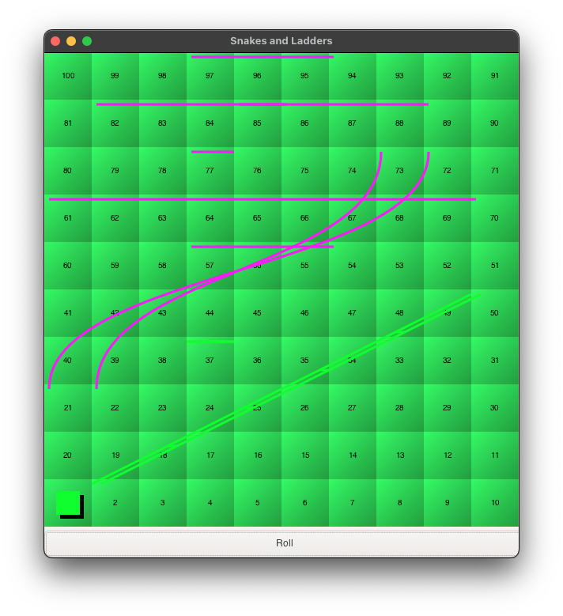
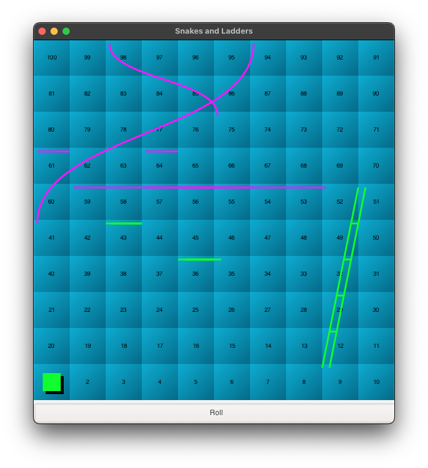
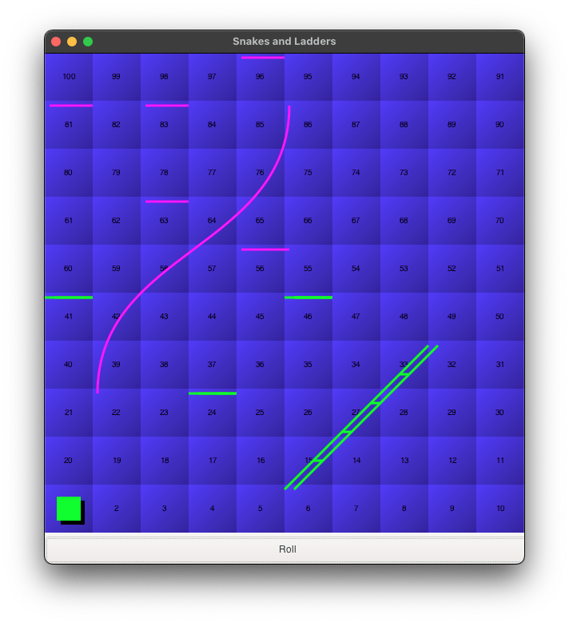

# Snakes and Ladders Game

This is a simple implementation of the Snakes and Ladders game in C++. The game is played by two players, where each player takes turns to roll a dice and move their piece on the board. The first player to reach the end of the board wins the game.

     

     

